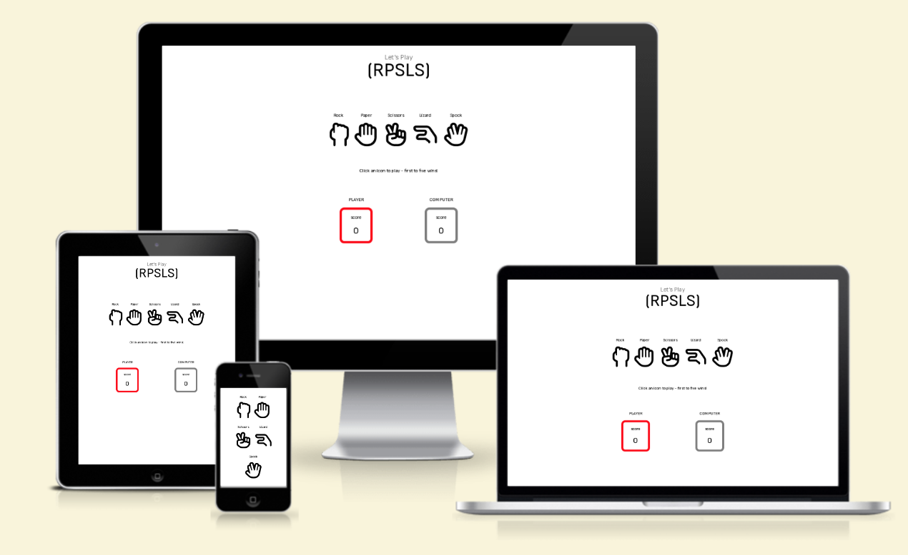
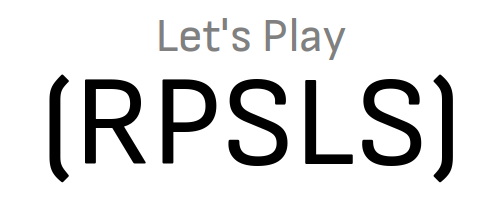
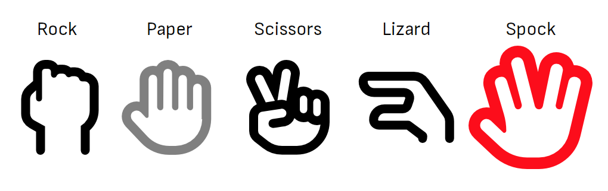
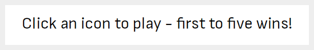
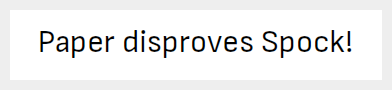
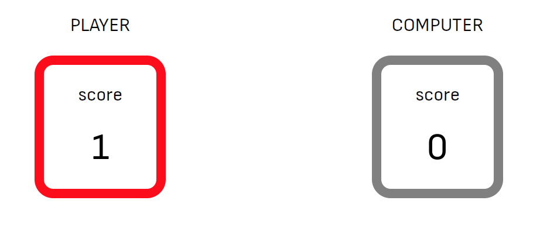

# Let’s play RPSLS (Rock-Paper-Scissors-Lizard-Spock)

[Let's play RPSLS](https://knutinator.github.io/lets-play-rpsls/) is a browser based JavaScript game of luck against the computer. It is a useful tool for people needing help to make decisions, since the outcome of each game is truly random.

The game is also targeted towards people who have heard about the "RPSLS" game from the TV series “The Big Bang Theory”, and wishes to try it out for themselves. 

## Features

### Existing Features

- Header

    - Sits at the top of the page and shows the name of the game in a minimalistic font.
    - Gets the users's attention and creates intrigue about the odd abbreviation.
    - RPSLS is written in brackets to give it a "technical" feel, in line with the game's nerd culture roots.

&nbsp; 

- Game interface

    - The game interface displays five icons to choose from, each of them below an explanatory label.
    - The labels doubles as explanation for the abbreviation RPSLS, which sits directly above.
    - When the user touches an icon, it turns bright red and increases in size, indicating that it can be clicked.
    - When clicked, the user's selected icon will remain bright red, while the computers selection will be displayed in gray. 

&nbsp; 

- Game explanation field

    - Below the game icons is a text field that changes use depending of the actions of the user.
    - At first, it encourages the user to start the game by clicking one of the icons, while also explaining the win conditions: First to five points wins.
    - When the game has started, the field instead explains the outcome of the latest game round, so the user understands what just happened. This also teaches the user the game rules.
    
<i><figcaption>Before game</figcaption></i>

<i><figcaption>During game</figcaption></i>

&nbsp; 

- Game results and score field

    - When the user clicks an icon, the JavaScript code chooses an icon for the computer player at random. 
    - The code then determines the winner of the round according to the game rules, and awards a point to the winning player.
    - The scores are counted in the two score boxes, which are clearly marked in an outline color which corresponds with the icon colors of the game field.
    - This gives the user a clear view of the current standing of the game, making it easy to play.
    - When either of the players has gained five points, they are declared the winner of the game. A pop-up message tells this to the player, and the game is automatically restarted, when the user clicks the "ok" button.

&nbsp; 

### Features left to implement

- I would like to expand the game with a multiplayer option, so the user can play either against a human or a computer.

## Development

- The development followed this process:

    - First, a barebone file and folder structure was set up for the project.
    - A simple outline of the needed elements and functions was sketched out in the empty HTML, CSS and JS files using code comments.
    - The basic content and elements were written in HTML and styled using CSS.
    - The JavaScript functions were coded and tested one at a time, to assure code legibility.
    - After all JavaScript code was functional, some parts with repetitions were refactored into shorter code.
    - Following testing, validation and bug-fixing, the project was deployed to Github Pages.

## Testing

- Game was tested and worked perfectly in three different browsers: Chrome, Firefox and Safari.
- Responsiveness was tested using Chrome Devtols and an Android Phone.
- Game was validated for Accessibility using Lighthouse in Devtools.
- HTML was validated using [W3C HTML Validator](https://jshint.com/).
- CSS was validated with [W3C CSS Validator (Jigsaw)](https://validator.w3.org/).
- JavaScript was validated with [JSHint JavaScript Validator](https://jigsaw.w3.org/css-validator/).
- All validation passed with no errors detected.

## Deployment

- Local deployment:

    - Download the project repository and extract the zip file in a folder on your hard drive.
    - Open the project folder with an IDE of your choice.
    - Run the project by dropping index.html into a web browser, or view it on an HTTP server by running the python command: python3 -m http.server

 - Github Pages deployment:

    - Copy or clone the repository.
    - In the Github repository, click the Settings Tab.
    - Select the Pages section.
    - Under the Build and deployment headline, click the dropdown menu under Branch and select "main". 
    - Click the save button.
    - Once the page has been deployed, you can access the live link from the Pages section.

Live link can be found here - [Let's play RPSLS](https://knutinator.github.io/lets-play-rpsls/)

## Credits

Styling

- Favicon generated using: https://favicon.io/

- Icons implemented using https://fontawesome.com/

Scripts

- Code for determining player choice was inspired by: https://www.codewizardshq.com/javascript-tutorial-for-kids-rock-paper-scissors/

- Code for increasing score tally was inspired by: https://stackoverflow.com/questions/68074211/make-score-counter-from-javascript-display-as-text-in-html
